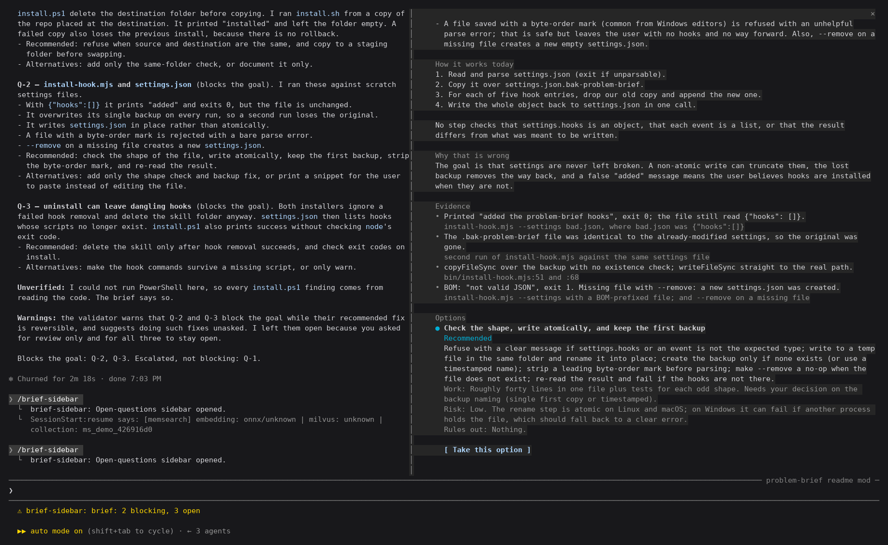
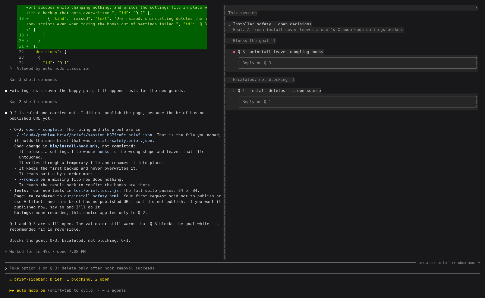

# problem-brief

A Claude Code skill for turning review findings into a page someone can make
decisions from.

Reviews produce lists. Lists are not decisions. This skill takes whatever came
out of a review — a multi-reviewer round, a static analysis pass, a benchmark
run — groups it by root cause, and renders a page where each entry states one
problem, proves it, and ends with a recommended way out and what that way costs.

The layout is fixed by a renderer rather than written by hand, so the reader
learns it once and never re-learns it.

## What an entry looks like

Five parts, always in this order:

1. **The problem** — one or two plain sentences naming what is wrong.
2. **Why it matters** — in the reader's terms, not the codebase's.
3. **Evidence** — one to four citations, each with a note saying what it shows.
4. **How it works today** — with a drawing where a drawing helps, and why that
   is wrong. Or the target state, where there is no defect.
5. **Options** — the recommendation first and labelled, each priced by work,
   risk, and what it rules out.

You write the content as JSON. The renderer produces the page. It refuses to
render an entry with no recommended option, a citation with no note, or an
option with no cost — the mistakes that make a brief unusable.

## Install

**macOS and Linux**

```sh
git clone https://github.com/zaytsevand/problem-brief
cd problem-brief
./install.sh              # or ./install.sh --link to track the repo
```

**Windows**

```powershell
git clone https://github.com/zaytsevand/problem-brief
cd problem-brief
.\install.ps1             # or .\install.ps1 -Link
```

Both install into your skills directory (`~/.claude/skills` on macOS and Linux,
`%USERPROFILE%\.claude\skills` on Windows), report whether the two skills this
one composes are present, and take `--uninstall` / `-Uninstall` to reverse.
Needs Node 18 or newer for the renderer; nothing else, and no npm install.

### The sidebar (a Claude Code mod)

Without the mod, keeping track of decisions is a two-surface job. The questions
live on a published page; the conversation where you answer them lives in the
terminal. To take a fork you open the page, read the options, switch back to the
session, type which one you chose and name the entry, and hope the model records
it in the brief. Whatever you read on one surface you carry to the other by hand.

With the mod it is one surface. The open questions sit in a pane beside the
conversation, and taking a fork is choosing between the outcomes the brief
already proposes: pick an option under the entry, add a note if you like, and
the reply goes to the model with the instruction to record it in the brief in
that turn. The pane redraws when the brief changes, so you see the ruling land.



*A live session after the skill reviewed this repo's installers and wrote a
brief. The pane, on the right, shows one question in full: the problem, the
evidence, how it works today, and the options, recommendation first.*



*After pressing "Take this option" on Q-2. The model recorded the ruling,
carried it out and re-rendered the page. Q-2 has left the pane, and the count
beside the prompt fell from 2 blocking, 3 open to 1 blocking, 2 open.*

Both captures are of a real run in a terminal, not a mock-up; rows listing the
author's unrelated briefs and a usage meter are blanked out.

`./install.sh --sidebar` (`.\install.ps1 -Sidebar`) also loads a Claude Code
plugin in every session, from the next one on. It shows the open questions of
the session's own briefs in a pane beside the conversation, each in full with
its options, and a reply box under each that sends your answer to the model with
the instruction to record it in the brief. Briefs from other sessions stay
folded at the bottom. The plugin also reminds the model, on every message, to
keep the briefs it works on up to date.

A brief counts as the session's own when the session writes it, when you reply
in it from the pane, or when it is named after the session
(`session-<first 8 characters of the session id>.brief.json`), which makes a
safe place to try it out. The installer adds the plugin's folder to
`CLAUDE_CODE_PLUGIN_DIRS` in the `env` block of `~/.claude/settings.json`;
`--uninstall` takes it out again. The plugin lives in `plugin/brief-sidebar`,
with its tests: `claude plugin test plugin/brief-sidebar`.

## Dependencies

| Skill | Does what here | Without it |
|---|---|---|
| [archify](https://github.com/tt-a1i/archify) | Draws the architecture, lifecycle, data-flow and sequence pictures. | You are left with mermaid — fine for a branch, poor for a real system view. |
| [humanizer](https://github.com/blader/humanizer) | Strips the tells of machine-written prose before publishing. | The brief reads as generated, which is what makes a reader stop trusting it. |

The install scripts check for both and print how to get them.

## Use it

Ask Claude Code for a brief and the skill picks itself up:

> group the review findings by root cause and build me a brief

Validate first — always, and especially when the JSON was generated:

```sh
node ~/.claude/skills/problem-brief/bin/validate-brief.mjs my-brief.json
```

It checks the file against the schema and against the rules a schema cannot
state, and reports an unknown field as the field you probably meant:

```
decisions[0] → solutions[0] has an unknown field "recommend"
    → did you mean "recommended"? Anything unknown is silently dropped when the page is built.
```

That matters because a misspelt field is not a crash. It is content quietly
missing from a page that still looks finished.

Then render:

```sh
node ~/.claude/skills/problem-brief/bin/render-brief.mjs my-brief.json out/index.html
```

`examples/example.brief.json` is a complete worked brief — three entries, both
kinds of drawing, one already closed, plus the handled and outstanding lists.
Start from it rather than from an empty file.

## The top of the page

The summary under the counts is structure, not a paragraph:

- **Since the last version**, from typed `changes`, with new entries first.
- **Waiting on you** is worked out from the entries, so it cannot disagree with the counts.
- `context` is short free text.
- `background` is folded away.

Wherever prose cites an entry, the page links the id and adds the entry's
`short` label: *Q-3 (resuming a handed-back import)*. An entry with no label
gets one cut from its title. Lines starting `- ` or `1. ` in any prose field
render as real lists, and the validator warns when a sentence enumerates
things that should have been one.

## An entry's life

An entry is never deleted and never renumbered, because its number is how people
cite it. It moves through four states instead:

| State | Page shows | Means |
|---|---|---|
| `open` | blocks the goal / escalated, not blocking | Waiting on a ruling. |
| `decided` | outstanding work | A way forward was chosen; it has not been carried out. |
| `complete` | complete | The chosen option was carried out. Closed, with proof. |
| `superseded` | retracted | The problem went away or was overtaken. |

A brief names its `goal`, and every entry still waiting on a ruling or on work
says how it bears on that goal: it **blocks the goal**, or it is **escalated,
not blocking** — a real decision for the reader that can wait.

Every run starts by bringing those states up to date, before any facts are
re-checked. The brief and every item on it carry `created` and `updated`
timestamps, and the page shows both, so the reader can see what moved. The
validator rejects a status that contradicts the entry's own record (a ruling
on an entry still marked open, work marked blocked on something already ruled)
and timestamps that contradict each other. Each run ends with a short chat
summary of what changed state.

The brief is also the session's memory. Every answer or judgement the operator
gives is written into it straight away, on the entry it settles or as a
standing ruling (`R-1`, `R-2`, …) when it reaches further. Nothing is raised
before it has been checked against every entry and every ruling, and the
validator warns when an entry looks like an earlier one or like a question
already answered. Each rendered page carries its own data, so a session that
has lost the JSON recovers it with `bin/extract-brief.mjs` instead of
rebuilding it from memory.

It plugs into Claude Code's own memory. `bin/brief-memory.mjs` registers a
brief as one pointer file in the project's memory directory, listed in
`MEMORY.md`, so every session knows the brief exists. The optional
SessionStart hook (`./install.sh --hook`, or `.\install.ps1 -Hook`) follows
those pointers at startup, resume, clear and after every summary, and puts the
standing rulings and live entries back in context. That is the moment answers
used to be lost. The same flag adds a PostToolUse hook on `Artifact`: after
every publish of a brief it compares the page with the previous publish and
hands Claude the chat summary, so the summary lists what moved and cannot
drift into retelling the brief.

A brief whose work is done, or that was only a test, is retired with
`bin/brief-retire.mjs`: taken out of memory and the hooks, its hook state
cleared, stamped `retired`, and its published pages listed. The pages are
never deleted without the operator's say-so.

`./install.sh --claude-md` (`.\install.ps1 -ClaudeMd`) adds one line to
`~/.claude/CLAUDE.md` making a brief the default channel for findings,
decisions and questions in every session, whether or not the hooks are
installed.

A brief can be bound to an item in the project's own tracker (`binding`: a
task, a spec, an ADR). Its ids are then shown and cited with that prefix,
`JOB-42/Q-3`, so they stay unambiguous across briefs and can be cited in the
tracker and in commits.

Comments on a published brief are answered automatically before the session
sees them, and the notification that wakes it does not carry the comment. The
comment hooks make sure the session reads the thread and records what it says
before the thread can be resolved, and a message citing a brief's ids gets the
cited items' state with a reminder to record the ruling.

Options say whether they can be undone (`reversible`), and only what can be
undone is ever handled without asking. Entries can wait on each other
(`blockedBy`), and the page puts first the ruling that frees the most work.

The counts along the top of the page are filters — click one and the page shows
that category alone. It opens on what blocks the goal, since that is what is
waiting on the reader. Above the entries, a short summary lists what waits on
the reader, then what changed since the last version, with earlier history
folded away. Every earlier version's change notes are kept too, behind a
*latest / all versions* switch. Everything stays in the document, so a link to
an entry reaches it whatever the filter was, and a page without scripting shows
the whole brief.

## Drawings

Three kinds:

- **mermaid** — inline, rendered natively by the page. For a shape you can state
  in a few lines.
- **archify** — the rendered archify page, embedded live in its own frame. Keeps
  its zoom, guided views and detail-on-hover. The frame takes the drawing's own
  proportions so nothing is cropped. The whole drawing travels **inside** the
  page by default, so the page stands alone and nothing has to be published
  beside it; `"embed": "file"` references it as a companion instead, for briefs
  large enough that page size matters. A drawing that cannot be carried becomes
  a visible note naming its source, never an empty frame.
- **svg** — a self-contained file, inlined, centred and scaled.

Keep the archify source file. The next refresh edits the drawing rather than
redrawing it, which is what loses the fallbacks and the error paths.

## Licence

MIT. See [LICENSE](LICENSE).
